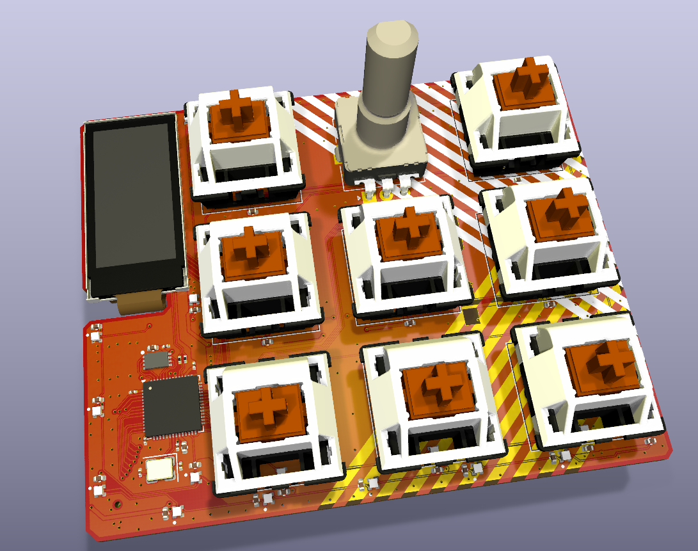

# Madpad

> Custom macropad based on **RP2040** with display, audio feedback, and per-key RGB lighting.  
> Designed as a versatile input device for PC with extra features for interaction and visualization.  

---

## What’s on the board
- **RP2040 microcontroller**  
  - USB device (HID, MIDI, or custom protocols)  
- **IPS display (0.96")**  
  - Controller: **ST7735**  
  - For status output, macro layers, menus, or visual effects  
- **Microphone**: INMP441ACEZ-R7 (I²S interface)  
- **Piezo buzzer** with transistor driver for sound feedback  
- **Rotary encoder** with integrated push button  
- **8 mechanical keys** (macro switches)  
- **RGB lighting**:  
  - 1× WS2812 (1×1 mm) LED per key  
  - Additional WS2812 LEDs distributed across the board for **ambient light effects**  

---

## Connectivity
- **USB Type-C** for both power and PC connection  
- Enumerates as **USB HID keyboard/macropad** (firmware-dependent)  
- Can be extended to **MIDI control surface** or custom USB interfaces  

---

## Use Cases
- Macro pad for productivity (shortcuts, hotkeys, macros)  
- Custom controller for audio/video editing software  
- Mini MIDI controller for music applications  
- Experiment platform for RGB effects + input devices  

---

## Notes
- LED layout allows both **per-key lighting** and **global light animations**.  
- Buzzer and microphone make the board suitable for **interactive feedback** or audio experiments.  
- Rotary encoder + display add flexibility for menus, layers, or volume control.  

---
